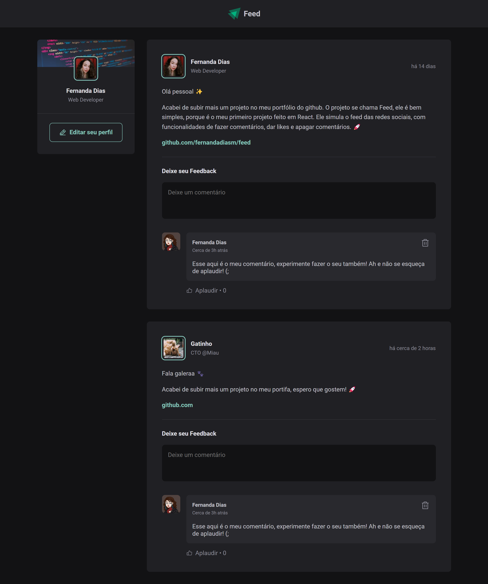

<h1 align="center"> Feed </h1>

  

  &nbsp;&nbsp;&nbsp;|&nbsp;&nbsp;&nbsp;
      <a href="#-projeto">Projeto</a>&nbsp;&nbsp;&nbsp;|&nbsp;&nbsp;&nbsp;
  <a href="#-tecnologias">Tecnologias</a>&nbsp;&nbsp;&nbsp;|&nbsp;&nbsp;&nbsp;
  <a href="#-funcionalidades">Funcionalidades</a>&nbsp;&nbsp;&nbsp;|&nbsp;&nbsp;&nbsp;
  <a href="#memo-licença">Licença</a>&nbsp;&nbsp;&nbsp;|&nbsp;&nbsp;&nbsp;

  

 

## 👩🏻‍💻 Projeto

O Feed é um projeto simples que simula o feed de uma rede social, com várias funcionalidades como: fazer comentários, dar likes e apagar comentários.

[🔗 É possível acessar o projeto clicando aqui! 🖥️](https://feed-eosin-tau.vercel.app/)

 

## 🚀 Tecnologias

Esse projeto foi desenvolvido com as seguintes tecnologias:

- HTML
- CSS
- ReactJS
- Vite
- React Dom
- Date-fns
- Phosphor-react

 

## ✔️ Funcionalidades

[x] - adicionar comentários

[x] - aplaudir (likes)

[x] - apagar comentário

 

## :memo: Licença

Esse projeto está sob a licença MIT.

---
#### Feito com ♥ by Fernanda Dias

  

